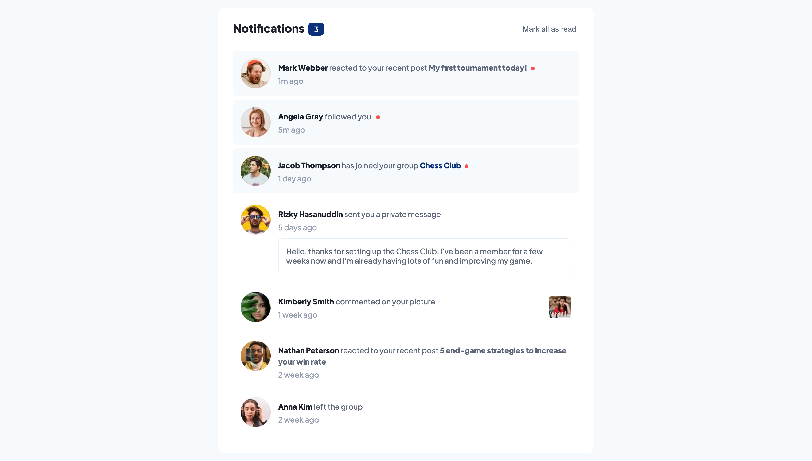

# Frontend Mentor - Notifications page solution

This is a solution to the [Notifications page challenge on Frontend Mentor](https://www.frontendmentor.io/challenges/notifications-page-DqK5QAmKbC). Frontend Mentor challenges help you improve your coding skills by building realistic projects.

## Table of contents

- [Overview](#overview)
  - [The challenge](#the-challenge)
  - [Screenshot](#screenshot)
  - [Links](#links)
- [My process](#my-process)
  - [Built with](#built-with)
- [Author](#author)

## Overview

### The challenge

Users should be able to:

- Distinguish between "unread" and "read" notifications
- Select "Mark all as read" to toggle the visual state of the unread notifications and set the number of unread messages to zero
- View the optimal layout for the interface depending on their device's screen size
- See hover and focus states for all interactive elements on the page

### Screenshot

### Links

- Solution URL: https://github.com/mike3497/front-end-mentor-notifications-page
- Live Site URL: https://loquacious-longma-82a276.netlify.app/

## My process

### Built with

- Vue
- Semantic HTML5 markup
- SCSS custom properties
- Flexbox

## Author

- Website - [Michael Carillon](https://www.michaelcarillon.com/)
- Frontend Mentor - [@mike3497](https://www.frontendmentor.io/profile/mike3497)
- Github - [@mike3497](https://github.com/mike3497)
